# Data Lovers

 

## Índice

- [Índice](#índice)
- [Introducción](#introducción)
- [Resumen del proyecto](#resumen-del-proyecto)
- [UX](#ux)
- [Historia 1](#historia-1)
- [Historia 2](#historia-2)
- [Historia 3](#historia-3)
- [Historia 4](#historia-4)
- [Historia 5](#historia-5)
- [Historia 6](#historia-6)

***

## Introducción

**POKEMON GO** es un videojuego de realidad aumentada basado en la localización desarrollado por Niantic, Inc.  para dispositivos iOS y Android. El juego consiste en buscar y capturar personajes de la saga Pokémon escondidos en ubicaciones del mundo real y luchar con ellos, lo que implica desplazarse físicamente por las calles de la ciudad para progresar. La aplicación comporta un elemento de interacción social, ya que promueve reuniones físicas de los usuarios en distintas ubicaciones de sus poblaciones.

Seguramente todos recordamos el boom que generó **Pokemon GO**  con su lazanamiento para Android y IOS  en el 2016, y es que millones de personas de todas las edades se unieron a la moda, alcanzó a todo tipo de público, incluso a quienes no sabían lo que era un Pokémon. Meses después muchos usuarios dejaron el juego debido a la falta de actualizaciones y a la carencia de ciertos modos de juegos que se consideraban esenciales, por lo que las cifras de usuarios activos disminuyó.
A pesar de que muchos daban al juego por muerto, Niantic y Nintendo nunca han dejado de añadir contenido al título; actualmente, según informa la web de The Guardian, **Pokemon Go** aún tiene la increíble cifra de 60 millones de usuarios activos, algo que sin duda tiene un gran mérito.

## Resumen del proyecto

Para nuestro proyecto **Data Lovers** del Common Core, hemos optado por el tema de **Pokemon Go** con lo cual buscamos brindar apoyo informativo a los usuarios de este juego a traves una aplicación similar a la pokedex que muestra información relevante de los pokemones de la región Kanto  y permita que los usuarios puedan interactuar con dicha información y conocer las características de aquellos pokemones que inclusive no están atrapados.

**El Usuario**
 Nuestros usuarios son personas que conocen, juegan o han jugado _Pokemon _GO_

 Para utilizar el Demo deberán tener como usuario y contraseña _**LABORATORIA**_

 

  <a href="https://zpl.io/boMyLqv">Zeplin Desktop</a> |
  <a href="https://zpl.io/adXqNK1">Zeplin Mobile</a>
   
  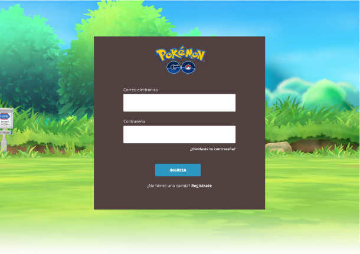
   
  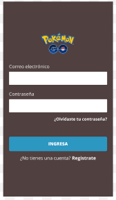
  

## UX
 **Investigación UX:**
   - *¿Quiénes son los usuarios y cuáles los objetivos en relación con el
   producto?*
    Nuestros ususarios son personas a partir de los 10 años quienes buscan conocer las características de cada Pokemon de la Región Kanto, muchos de los usuarios han jugado o juegan Pokemon GO, pero también estan los que conocen el juego y desean jugar y para ellos también es importante conocer quienes son los pokemones, sus característica, a que tipo pertenece, cuantos son en total, si evoluciona y en qué pokemon evoluciona?, entre otras.

   - *¿Cómo solucionamos los problemas/necesidades de los usuarios?*
    Brindaremos una interfaz que les permita  ingresar a través de un usuario y contraseña, puedan visualizar los pokemones de la región Kanto, al darle click a cada pokemón podrán visualizar sus principales características, además la interfaz también permite conocer cuantos pokemones tengo atrapados,  podrá ordenar la data de pokemones por nombre y frecuencia de aparición, el usuario podrá filtrar la data  por tipo y debilidades y conocer que pokemones eclosionan en cada tipo de huevo...

## Historia 1
**_Como usuaria quiero poder loguearme para acceder al sitio web_**
 Este fue realizado tal cual se nos planteó el modelo por parte de Laboratoria tanto para destop como para mobile.
  

  
  

## Historia 2
**_Como usuaria quiero poder ver a todos los pokemones al ingresar a la página para saber cuántos tengo y cuántos me faltan atrapar_**
 - *Prototipo de Baja Calidad (mobile y desktop)En Papel*
  

    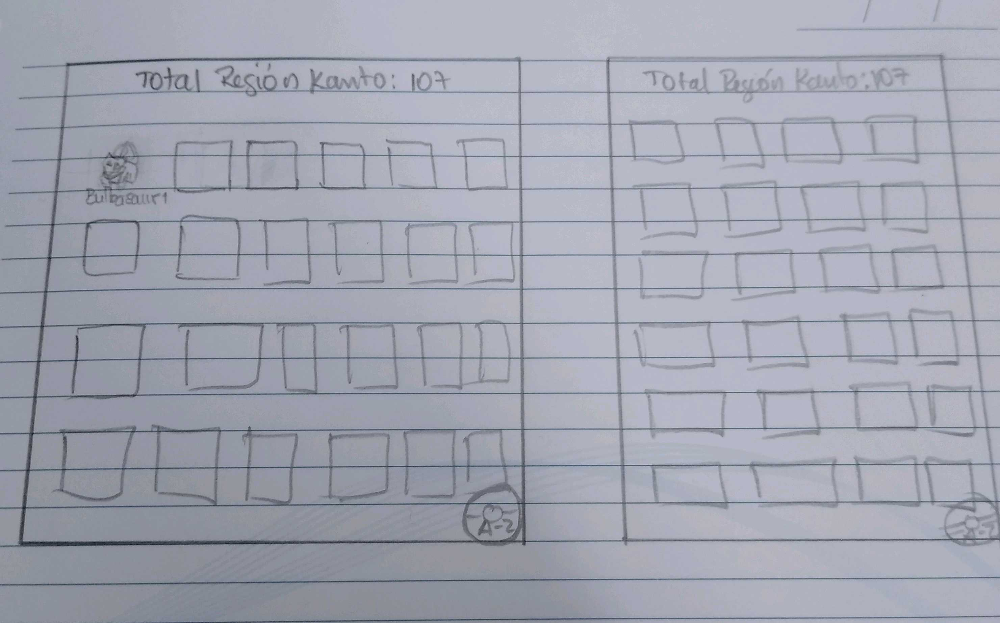
  

 -  *Feedback y mejoras*
  Se mostraban los pokemones en la pantalla, pero sin ninguna base, por lo que se diseño un formato que le figure como base  y de esta manera no queden al aire. 
  Cada pokemón muestra los nombres y si está atrapado o aúm no, los pokemones que aun no estan atrapado figuran con un tono odcuro en la imagen, además del total de atrapados y los que faltan por atrapar. 
  

    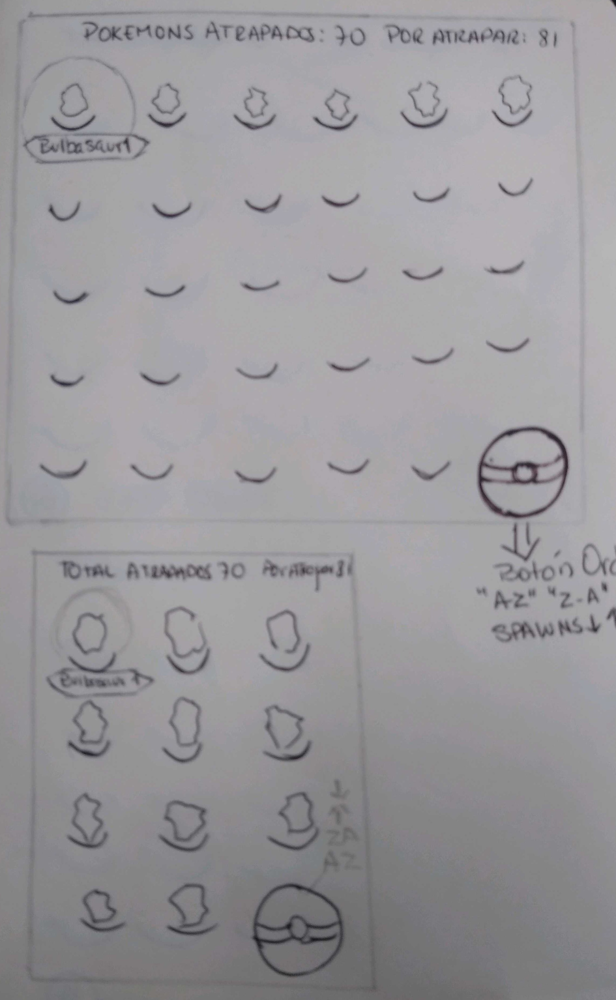
  

 - *Imagen y link del prototipo de alta fidelidad final (mobile y desktop) en
   Figma.*
  

  <a href="https://zpl.io/2GAY1zd">Zeplin Desktop</a>
    
  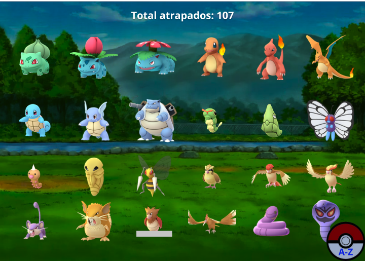
   
  <a href="https://zpl.io/a3jw9Xy">Zeplin Mobile</a>
   
  
  

  ## Historia 3
  **_Como usuaria quiero poder elegir un pokemon para ver sus características más relevantes_**
 - *Prototipo de Baja Calidad (mobile y desktop)_En Papel_*
  

    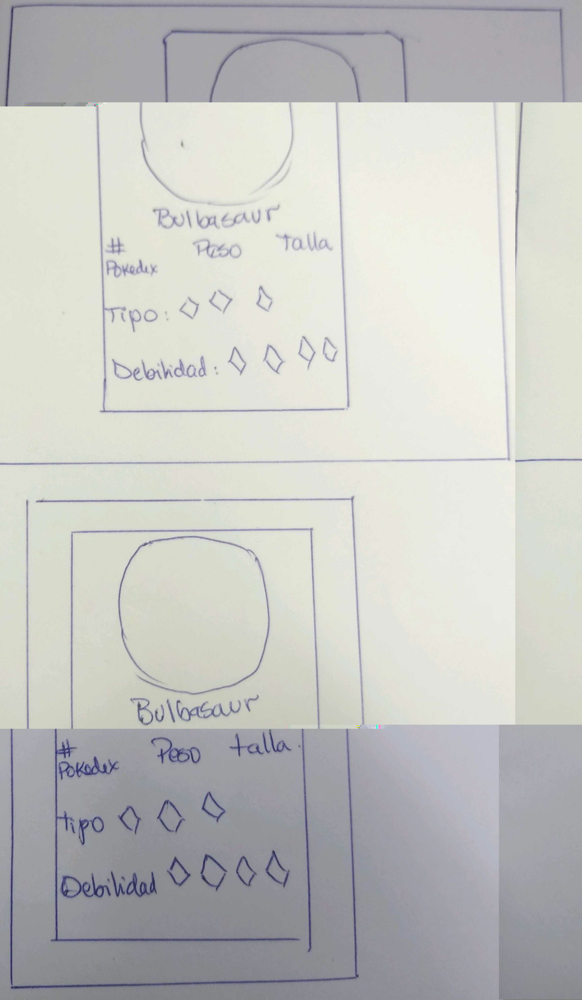
  

 -  *Feedback y mejoras*
   La cartilla a pedido del usuario muestra su Número, Peso, talla, debilidades y tipos. 
  
 - *Imagen y link del prototipo de alta fidelidad final (mobile y desktop) en
   Figma.*
  

  <a href="https://zpl.io/29K8nRy">Zeplin Desktop</a>
    
  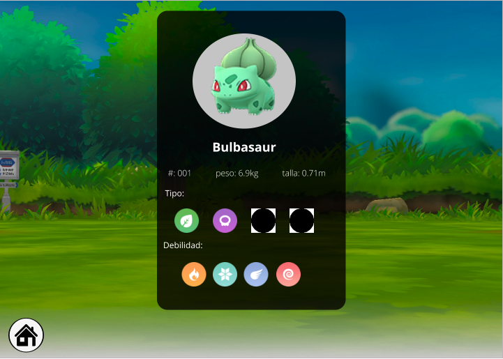
   
  <a href="https://zpl.io/blMW6rz">Zeplin Mobile</a>
   
  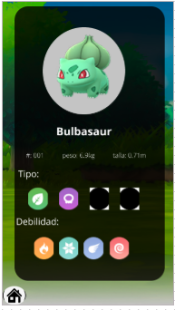
  

  ## Historia 4
  **_Como usuaria quiero poder ordenar por orden alfabético (A-Z y Z-A) y frecuencia de aparición (spawn) de manera ascendente (menor a mayor) o descendente (mayor a menor) a los pokemones para poder ubicarlos fácilmente y saber cuáles son los más difíciles de atrapar_**
 - *Prototipo de Baja Calidad (mobile y desktop)_En Papel_*
  

    
  

 -  *Feedback y mejoras*
  El usuario deseaba una vista muy colorida y muy relacionada al juego, por ello se implementó el boton Pokebola para el ordenado. 
 - *Imagen y link del prototipo de alta fidelidad final (mobile y desktop) en Figma
  

  <a href="https://zpl.io/VOdgpB1">Zeplin Desktop</a>
    
  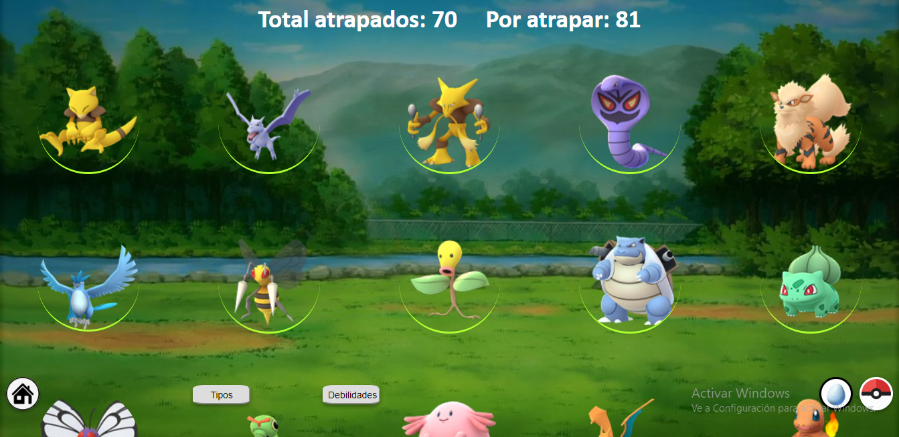
   
  <a href="https://zpl.io/aw6APnJ">Zeplin Mobile</a>
   
  
  

  ## Historia 5
  **_Como usuaria quiero poder filtrar a los pokemones por tipo y debilidades para saber quiénes y cuántos son de cada tipo y tienen esa debilidad_**
 - *Prototipo de Baja Calidad (mobile y desktop)_En Papel_*
  

    
  
  
 - *Imagen y link del prototipo de alta fidelidad final (mobile y desktop) en
   Figma.*
  

  <a href="https://zpl.io/aMpzj7m">Zeplin Desktop Tipo</a> /
  <a href="https://zpl.io/V45496Q">Zeplin Desktop Debilidad</a>
    
  
  
   
  <a href="https://zpl.io/2jMXWkx">Zeplin Mobile Tipo</a> /
  <a href="https://zpl.io/amMrW1m">Zeplin Mobile Debilidad</a>
   
  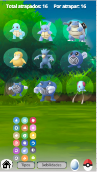
  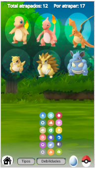
  

   ## Historia 6
  **_Como usuaria quiero poder obtener el porcentaje de los pokemones que aparecen en los diferentes tipos de huevo para saber qué huevos eclosiona_**

 - *Imagen y link del prototipo de alta fidelidad final (mobile y desktop) en
   Figma.*
  

  <a href="https://zpl.io/2v6zo7n">Zeplin Desktop</a>
    
  
   
  <a href="https://zpl.io/a89mJyd">Zeplin Mobile</a>
   
  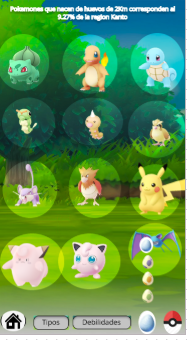
  

El Presente proyecto ha sido testeado mediante Jest. 

Atentamente, 
 
Sabrina y Karim. 